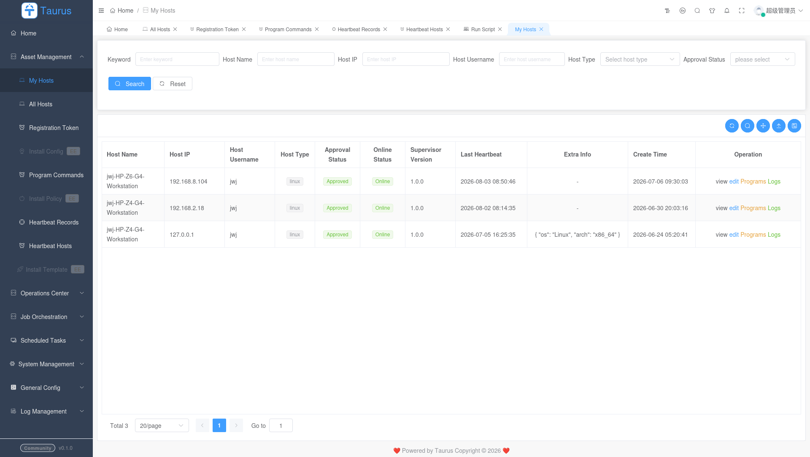
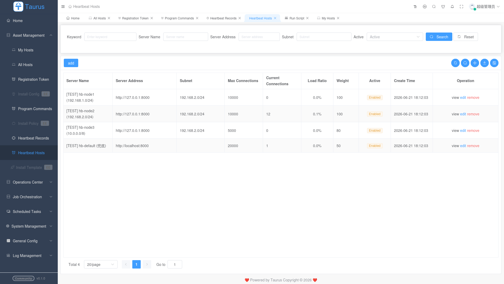
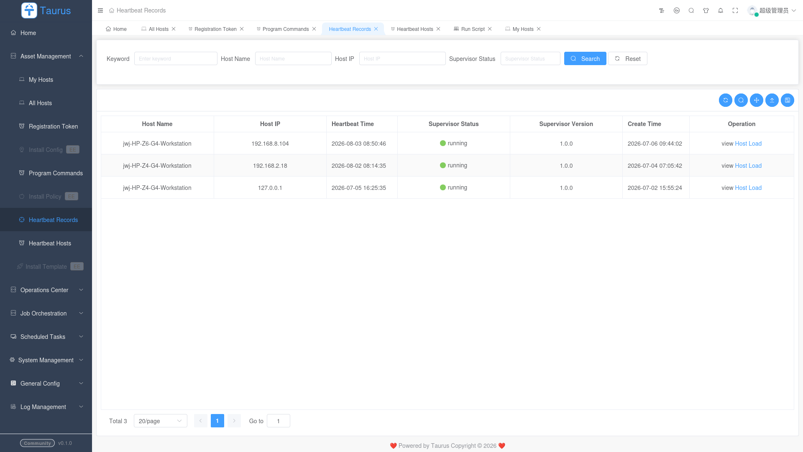
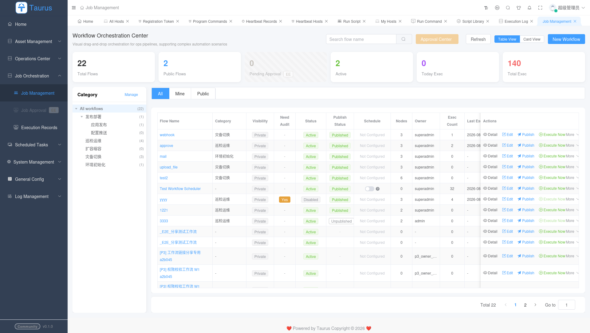
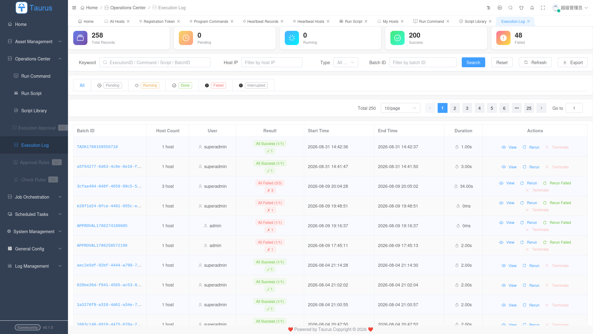
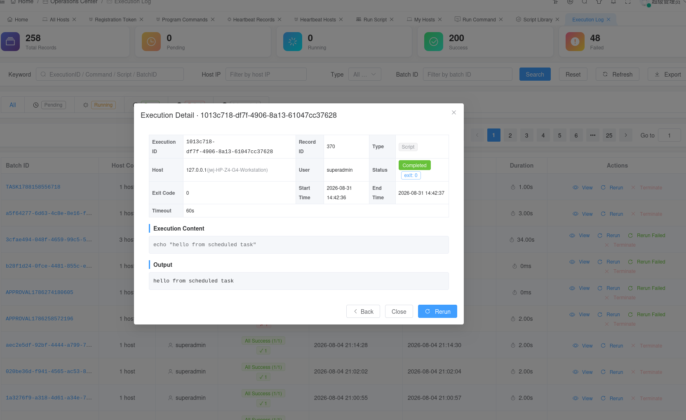
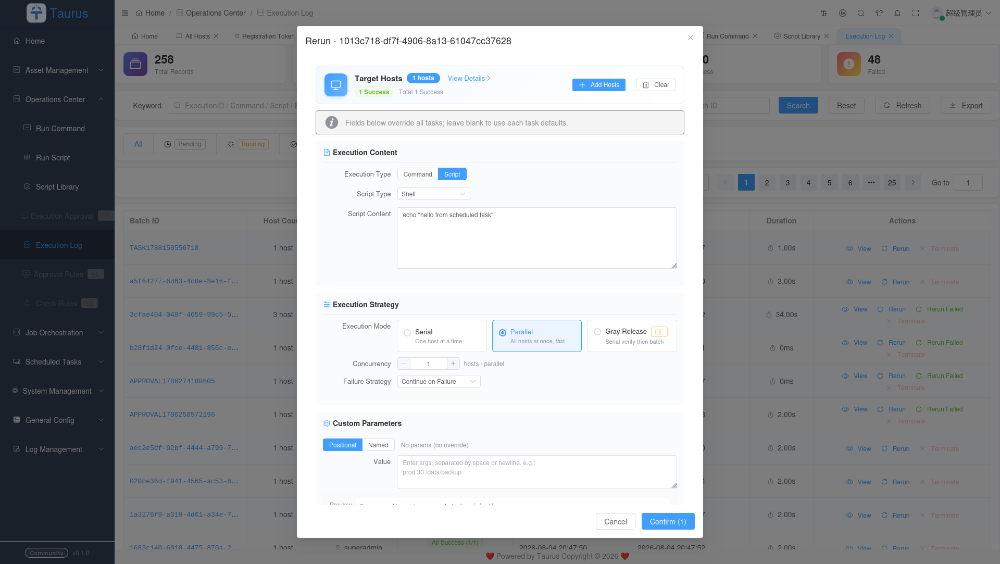
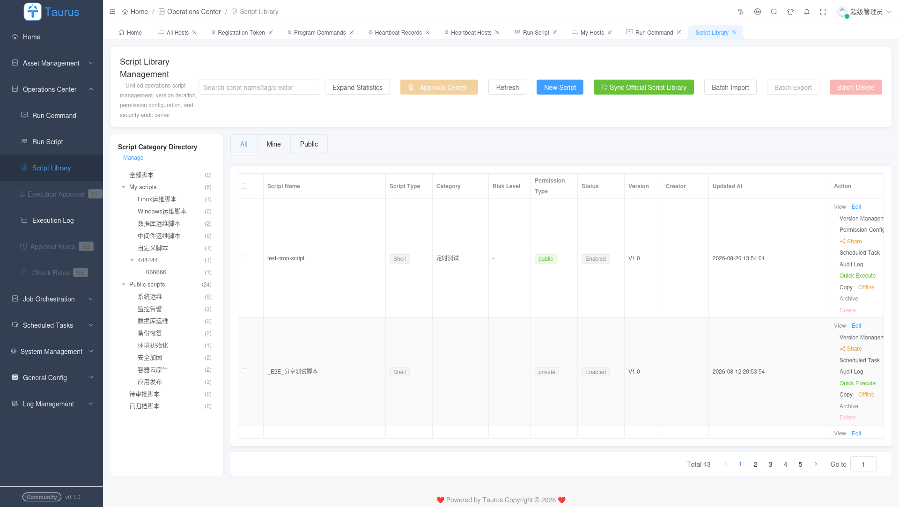
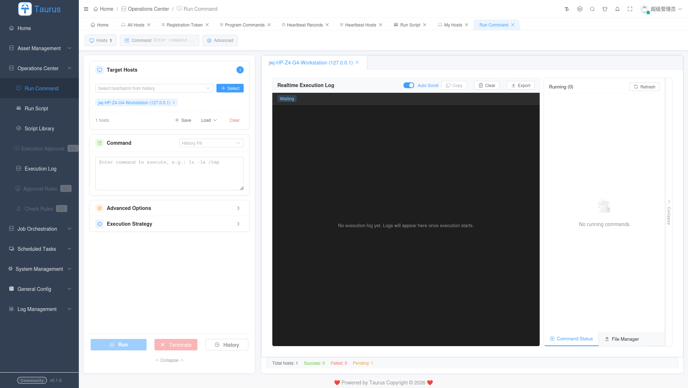

# Taurus Stack

<div align="center">

**Distributed Operations Management System**

[English](README.md) | [中文](README.zh-CN.md)

[](LICENSE)
[](https://www.python.org/)
[](https://vuejs.org/)
[](https://www.typescriptlang.org/)
[](https://taurus-stack.github.io/taurus-portal/)

</div>

---

## What is Taurus Stack?

Taurus Stack is a comprehensive distributed operations management system (堡垒机 / 运维管理平台) designed for managing remote hosts, executing commands, and monitoring system health. It provides secure, scalable, and reliable infrastructure management capabilities.

---

## Screenshots

### Dashboard & Host Management

| Home Dashboard                        | My Hosts                                        | Heartbeat Hosts                                                        | Heartbeat Record                                                          |
|:-------------------------------------:|:-----------------------------------------------:|:----------------------------------------------------------------------:|:-------------------------------------------------------------------------:|
| [](img/home.png) | [](img/my-host.png) | [](img/heartbeat-hosts.png) | [](img/heartbeat-record.png) |

### Job Management

| Job Management                                                      | Job Execution Detail                                                   | Job Node Execution Detail                                                             |
|:-------------------------------------------------------------------:|:----------------------------------------------------------------------:|:-------------------------------------------------------------------------------------:|
| [](img/job-management.png) | [](img/job-exec-detail.png) | [](img/job-node-exec-detail.png) |

| Execution Records                                                            | Execution Log                                                    | Run Detail                                              | Rerun                                    |
|:----------------------------------------------------------------------------:|:----------------------------------------------------------------:|:-------------------------------------------------------:|:----------------------------------------:|
| [](img/execution-records.png) | [](img/execution-log.png) | [](img/run-detail.png) | [](img/rerun.png) |

### Scripts & Commands

| Script Library                                                      | Run Script                                              | Program Commands                                                          | Run Command                                                |
|:-------------------------------------------------------------------:|:-------------------------------------------------------:|:-------------------------------------------------------------------------:|:----------------------------------------------------------:|
| [](img/script-library.png) | [](img/run-script.png) | [](img/program-commands.png) | [](img/run-command.png) |

### Registration

| Registration Token                                                              |
|:-------------------------------------------------------------------------------:|
| [](img/registration-token.png) |

---

## Architecture

```
┌─────────────────────────────────────────────────────────────────────────────┐
│                          Taurus Stack Architecture                           │
├─────────────────────────────────────────────────────────────────────────────┤
│                                                                             │
│   ┌──────────────┐  HTTP/REST+JWT   ┌──────────────────────────────────┐  │
│   │   Taurus Web  │ ───────────────►│        Taurus Backend              │  │
│   │   (Vue 3)     │ ◄────────────── │      (Django 4.2 + dvadmin)       │  │
│   └──────────────┘  WebSocket        │                                   │  │
│                                       └──────┬──────┬──────────────────┘  │
│                                              │      │                       │
│                     ┌────────────────────────┘      │                      │
│                     │ gRPC + mTLS                    │ HTTP + JWT           │
│   ┌──────────────┐  │                                │                      │
│   │   Taurus     │  ▼                                ▼                      │
│   │  Executor    │ ◄───────────────────────┐     ┌──────────────┐         │
│   │  (gRPC)      │ ───────────────────────►│     │ Taurus Auth  │         │
│   └──────────────┘                         │     │ (Ticket Svc) │         │
│                                             │     └──────────────┘         │
│   ┌──────────────┐  HTTP(Heartbeat)        │                                │
│   │   Taurus     │ ◄───────────────────────┘                                │
│   │ Supervisor   │  (asyncio daemon)                                        │
│   └──────────────┘                                                          │
│                                                                             │
│   ┌──────────────┐              Redis Queue              ┌──────────────┐  │
│   │   Taurus     │ ─────────────────────────────────────►│ Taurus Backend│  │
│   │  Scheduler   │   APScheduler + Leader Election       │ (run_scheduler│  │
│   │ (standalone) │                                        │  _worker)     │  │
│   └──────────────┘                                        └──────────────┘  │
│                                                                             │
└─────────────────────────────────────────────────────────────────────────────┘
```

### Communication Overview

| Link                 | Protocol         | Auth                        | Purpose                                |
| -------------------- | ---------------- | --------------------------- | -------------------------------------- |
| Web → Backend        | HTTP/REST + JWT  | HMAC-SHA256 signed tokens   | Management API                         |
| Backend ↔ Executor   | gRPC + mTLS      | Mutual TLS certificates     | Remote command execution               |
| Backend ↔ Supervisor | HTTP + Signature | HMAC-SHA256 request signing | Heartbeat + Program control            |
| Backend ↔ Auth       | HTTP + JWT       | JWT with service secret     | One-time execution ticket verification |
| Scheduler → Backend  | Redis Queue      | Redis auth                  | Schedule dispatch                      |

---

## Repository Structure

This is a **git submodule** aggregate repository. Each service lives in its own repository with independent versioning and `.gitignore`.

```
taurus-stack/                          ← Root (this repo, aggregation only)
├── .gitmodules                        ← Submodule definitions
├── README.md / README.zh-CN.md        ← You are here
├── docs/                              ← Cross-repository documentation
│
├── taurus-backend/  🔧 git submodule  ← Django 4.2 + dvadmin (API server)
│   ├── application/                   ← Django project config
│   ├── taurus/                        ← Business logic
│   │   └── serializers.py / views.py
│   └── certs/                         ← CA certificates (gitignored)
│
├── taurus-web/      🔧 git submodule  ← Vue 3 + TS + Element Plus + fast-crud
├── taurus-executor/ 🔧 git submodule  ← Python + gRPC remote executor
├── taurus-supervisor/ 🔧 git submodule ← asyncio host daemon
├── taurus-auth/     🔧 git submodule  ← Django ticket-based auth service
└── taurus-scheduler/ 🔧 git submodule ← APScheduler standalone service
```

### Clone the full stack

```bash
# Clone with all submodules
git clone --recurse-submodules https://github.com/taurus-ops/taurus-stack.git
cd taurus-stack

# Update submodules to latest
git submodule update --remote --recursive

# Individual submodule URLs: see .gitmodules
```

---

## Quick Start

### Prerequisites

- Python 3.12+
- Node.js >= 18.0.0
- MySQL/MariaDB (8.0+)
- Redis (6.0+)
- Poetry (Python dependency management)
- pnpm (Frontend dependency management)

### One-click startup (recommended)

```bash
# 0. Clone with submodules
git clone --recurse-submodules https://github.com/taurus-ops/taurus-stack.git
cd taurus-stack

# 1. Init (install + migrate + init; run on first setup or after a clean)
./scripts/dev.sh --init

# 2. Start the minimal chain (backend + WS + auth + web; three background processes)
./scripts/dev.sh

# Or the full chain (adds scheduler + scheduler-worker)
./scripts/dev.sh --all
```

Once up, open `http://localhost:3000` — default account **superadmin / admin123456**.

> Other `dev.sh` flags: `--backend`, `--auth`, `--web`, `--scheduler`, `-h` for help.

### VS Code one-click debugging (launch.json)

The root `.vscode/launch.json` ships pre-configured launch combinations — just press F5:

| Configuration                  | Includes                                        |
| ------------------------------ | ----------------------------------------------- |
| 🚀 完整开发环境                  | backend + WebSocket                             |
| 🚀 完整开发环境 + 定时任务        | backend + WS + scheduler + scheduler-worker     |
| 🌐 全栈开发                    | backend + WS + web                              |
| 🌐 全栈开发 + 定时任务            | backend + WS + web + scheduler + worker         |
| 🔐 票据鉴权开发                  | backend + auth + executor                       |

### Development Setup (Community Edition)

```bash
# 0. Clone with submodules
git clone --recurse-submodules https://github.com/taurus-ops/taurus-stack.git
cd taurus-stack

# 1. Backend
cd taurus-backend
poetry install
cp conf/env.example.py conf/env.py     # Edit DB/Redis/secret values
poetry run python manage.py migrate
poetry run python manage.py runserver 0.0.0.0:8000

# 2. Auth (another terminal)
cd taurus-auth
poetry install
cp .env.example .env                   # Match shared secret with backend
poetry run python manage.py migrate
poetry run python manage.py runserver 0.0.0.0:8001

# 3. Web (another terminal)
cd taurus-web
pnpm install
pnpm run dev                           # Vite dev server on port 3000

# 4. Register a remote host
curl -fsSL http://localhost:8000/api/taurus/supervisor/install_script/ \
  | bash -s -- --token <your-token> --auto-install
```

### Docker Compose

```bash
docker-compose up -d
docker-compose logs -f taurus-backend
```

---

## Security

### Certificate Management

```
taurus-backend/certs/           (gitignored — secrets never committed)
├── ca.crt                      # CA certificate (public, distributable)
├── ca.key                      # ⚠️ CA private key (keep offline!)
├── client.crt                  # Client certificate
├── client.key                  # ⚠️ Client private key
└── openssl.cnf                 # OpenSSL configuration
```

### Environment Variables

| Variable                     | Service           | Description                              | Default                    |
| ---------------------------- | ----------------- | ---------------------------------------- | -------------------------- |
| `AUTH_SERVICE_URL`           | Backend/Auth      | Auth service base URL                    | `http://localhost:8001`    |
| `REDIS_URL`                  | Backend/Scheduler | Redis connection                         | `redis://localhost:6379/0` |

---

## Documentation

Cross-repository design docs live in this root repo:

- [docs/architecture.md](docs/architecture.md) — System architecture, protocols, data flow
- [docs/developer-guide.md](docs/developer-guide.md) — Per-subproject developer guide (layout, env vars, start/test commands)
- [CONTRIBUTING.md](CONTRIBUTING.md) — Multi-repository development workflow

Service-specific docs live in each subrepo:

- [taurus-backend/docs/](taurus-backend/docs/) — API and models dev guide
- [taurus-executor/docs/](taurus-executor/docs/) — gRPC executor, deployment, upgrade
- [taurus-supervisor/](taurus-supervisor/README.md) — Host daemon, communication protocol

---

## Contributing

Please read [CONTRIBUTING.md](CONTRIBUTING.md) for details on our multi-repository development workflow, branching strategy, and code review process.

For security issues, see the `SECURITY.md` in each subproject.

---

## License

GNU Affero General Public License v3.0 — see [LICENSE](LICENSE)

---

## Links

| Service          | Repository                                                           | Issues                                                                |
| ---------------- | -------------------------------------------------------------------- | --------------------------------------------------------------------- |
| **Portal**       | [taurus-portal](https://github.com/taurus-stack/taurus-portal)       | [site](https://taurus-stack.github.io/taurus-portal/)                 |
| Backend          | [taurus-backend](https://github.com/taurus-ops/taurus-backend)       | [tracker](https://github.com/taurus-ops/taurus-backend/issues)        |
| Web              | [taurus-web](https://github.com/taurus-ops/taurus-web)               | [tracker](https://github.com/taurus-ops/taurus-web/issues)            |
| Executor         | [taurus-executor](https://github.com/taurus-ops/taurus-executor)     | [tracker](https://github.com/taurus-ops/taurus-executor/issues)       |
| Supervisor       | [taurus-supervisor](https://github.com/taurus-ops/taurus-supervisor) | [tracker](https://github.com/taurus-ops/taurus-supervisor/issues)     |
| Auth             | [taurus-auth](https://github.com/taurus-ops/taurus-auth)             | [tracker](https://github.com/taurus-ops/taurus-auth/issues)           |
| Scheduler        | [taurus-scheduler](https://github.com/taurus-ops/taurus-scheduler)   | [tracker](https://github.com/taurus-ops/taurus-scheduler/issues)      |
| **Stack (this)** | [taurus-stack](https://github.com/taurus-ops/taurus-stack)           | [discussions](https://github.com/taurus-ops/taurus-stack/discussions) |